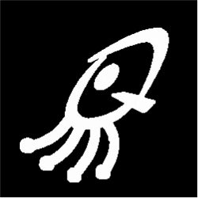

  

<h3 align="center"><em>"I believe technology is only meaningful when it improves people's lives. Between bare hands and a qubit dance, I design solutions chasing the same thing: a smile, a life made quietly better."</em></h3>

  
  &nbsp;&nbsp;
  

---

## 

  
  &nbsp;&nbsp;&nbsp;&nbsp;
  

**Internship — Fundación Computaex (2026):** developing a quantum simulator in Python with **NetSquid** to model NV and SnV color centers, and designing distributed architectures of the **Deutsch algorithm** between quantum nodes connected via photonic links.

**Master's Thesis — Quantum Smoothed Particle Hydrodynamics (Q-SPH):** an algorithm based on continuous-time *quantum walks* to simulate fluid particle dynamics, implemented and benchmarked in **Qiskit** against an equivalent classical simulation.

  
  
  

## 

  

## 

| Project | Role | Description | Stack |
|---|---|---|---|
| **Bachelor's Thesis — Axial Turbine with IoT** | Engineer | Manufacturing of an axial turbine with IoT monitoring: CAD, CNC, 3D printing, telemetry via Raspberry Pi and sensor calibration. |   |
| **GlowUpy** | Lead Developer & Product Manager | Full-stack architecture, business workflow automation, API integrations and deployment of scalable systems. |   |
| **Wazpi** | Product Manager & Developer | Automation of document processing with OCR and a chatbot-assisted CRM, secure cloud deployment. |   |

---

  
  &nbsp;
  
  &nbsp;
  

  

